# Explorar IBM Transformation Advisor

## Recopilación de datos, evaluaciones y aceleradores de implementación


**Última actualización:** marzo de 2024

**Duración:** 45 minutos

¿Necesitas ayuda? Contacta con **Kevin Postreich, Yi Tang.**

## Explorar IBM Transformation Advisor

Este laboratorio proporciona experiencia práctica fundamental en el proceso de evaluación de aplicaciones WebSphere para su modernización a Liberty y nubes basadas en contenedores. Muestra la utilidad de usar Transformation Advisor (TA) para evaluar aplicaciones Java locales e identificar una candidata para la migración a la nube.

También aprenderá a utilizar los aceleradores de implementación que TA genera para ayudar a implementar y ejecutar aplicaciones Java en Liberty y en contenedores.

Al finalizar este laboratorio, habrá adquirido experiencia en el uso de TA para analizar rápidamente aplicaciones Java locales sin acceder a su código fuente, estimar el esfuerzo de migrar a nubes basadas en contenedores y usar los aceleradores de implementación de TA para acelerar su viaje de modernización de aplicaciones a Liberty y contenedores.

**IBM Cloud Transformation Advisor** (Transformation Advisor) es una herramienta de modernización de aplicaciones que se puede obtener a través de IBM Cloud Pak for Applications e IBM WebSphere Hybrid Edition. Transformation Advisor le ayuda a evaluar rápidamente aplicaciones Java EE locales para su implementación en la nube.

**La herramienta Transformation Advisor proporciona el siguiente valor:**

- Identificar los modelos de programación Java EE en la aplicación.

- Determinar la complejidad de las aplicaciones enumerando un inventario de alto nivel del contenido y la estructura de cada aplicación.

- Resaltar el modelo de programación Java EE y las diferencias de la API de WebSphere entre los tipos de perfil de WebSphere

- Identificar las diferencias de implementación de la especificación Java EE que podrían afectar la aplicación

- generar aceleradores para implementar la aplicación en Liberty y contenedores en un entorno de destino.

Además, la herramienta recomienda la edición más adecuada de IBM WebSphere Application Server y ofrece consejos, mejores prácticas y posibles soluciones para evaluar la facilidad de migrar aplicaciones a Liberty o versiones más recientes de WebSphere tradicional. Acelera la migración de aplicaciones a la nube, minimiza errores y riesgos, y acorta el tiempo de comercialización.

## 1. Introducción

Como se muestra en la imagen a continuación, su empresa tiene varias aplicaciones web implementadas en el entorno de WebSphere Application Server (WAS).

<kbd></kbd>

Su empresa desea migrar estas aplicaciones al servidor WebSphere Liberty moderno en una nube basada en contenedores. Sin embargo, no está seguro del esfuerzo que requerirá el proceso de migración.

Decide utilizar IBM Transformation Advisor para realizar una evaluación rápida de estas aplicaciones sin su código fuente para identificar una buena aplicación candidata para migrar a Liberty y a la nube basada en contenedores.

Después de determinar una aplicación candidata para la modernización a WebSphere Liberty, utilice los aceleradores generados por TA para implementar y ejecutar la aplicación en WebSphere Liberty en su máquina de desarrollador local y en contenedores para validar la solución.

## 2. Objetivo

Los objetivos de este laboratorio son:

- Aprenda a recopilar datos de configuración y aplicaciones Java mediante la herramienta Transformation Advisor Data Collector.

- Aprenda a utilizar el Asesor de Transformación para evaluar el esfuerzo necesario para modernizarse a Liberty y a las nubes basadas en contenedores e identificar buenas aplicaciones candidatas para la modernización.

- Aprenda a utilizar los aceleradores generados por Transformation Advisor para implementar una aplicación candidata en WebSphere Liberty y contenedores.

## 3. Requisitos previos

Los siguientes requisitos previos deben completarse antes de comenzar este laboratorio:

- Familiaridad con los comandos básicos de Linux

- Tener acceso a Internet

- Tenga listo un entorno de laboratorio

<br>

## Accediendo al entorno

Si realiza este laboratorio como parte de un taller impartido por un instructor (virtual o presencial), ya se le ha proporcionado un entorno. El instructor le proporcionará los detalles para acceder al laboratorio.

De lo contrario, deberá reservar un entorno para el laboratorio. Puede obtenerlo aquí. Siga las instrucciones en pantalla para la opción " **Reservar ahora** ".

[https://techzone.ibm.com/collection/libery-getting-started-labs](https://techzone.ibm.com/collection/libery-getting-started-labs)

El entorno de laboratorio contiene una (1) máquina virtual Linux, denominada Workstation.

<kbd></kbd>

<br>

1. Acceda al entorno de laboratorio desde su navegador web.

    Se configura un `Published Service` para proporcionar acceso a la máquina virtual **`Workstation`** a través de la interfaz noVNC para el entorno de laboratorio.

    a. Cuando se aprovisione el entorno de demostración, haga clic en el **`environment tile`** para abrir su vista de detalles.

    b. Haga clic en el enlace **`Published Service`** que mostrará una **lista del directorio.**

    c. Haga clic en el enlace **`vnc.html`** para abrir el entorno de laboratorio a través de la interfaz **noVNC** .

    <kbd>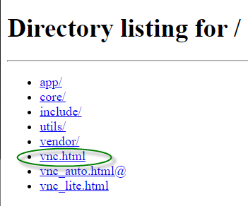</kbd>

    d. Haga clic en el botón **`Connect`**

    <kbd></kbd>

    e. Ingrese la contraseña: **`IBMDem0s!`** Luego, haga clic en el botón **`Send Credentials`** para acceder al entorno de laboratorio.

    > Nota: ¡Eso es un cero numérico en IBMDem0s!

    <kbd></kbd>

     <br>
    

2. Si se le solicita iniciar sesión en la máquina virtual de la "estación de trabajo", utilice las credenciales a continuación:

    Las credenciales de inicio de sesión para la **estación de trabajo "** VM" son:

    - ID de usuario: **techzone**

    - Contraseña: **IBMDem0s!**

    > Nota: Eso es un cero numérico en la contraseña.

     <br>


    <kbd></kbd>

     <br>
    

## 5. Consejos para trabajar en el entorno de laboratorio

1. Puede cambiar el tamaño del área visible utilizando las opciones **de configuración de noVNC** para cambiar el tamaño del escritorio virtual para que se ajuste a su pantalla.

    a. Desde la máquina virtual del entorno, haga clic en el **icono de giro** en el panel de control noNC para abrir el menú.

    <kbd></kbd>

    b. Para aumentar el área visible, haga clic en `Settings > Scaling Mode` y configure el valor en `Remote Resizing`

    <kbd></kbd>

2. Puede copiar/pegar texto de la guía de laboratorio en el entorno de laboratorio utilizando el portapapeles en el visor noVNC.

    a. Copie el texto de la guía de laboratorio que desea pegar en el entorno de laboratorio.

    b. Haga clic en el icono **`Clipboard`** y **`paste`** el texto en el portapapeles de noVNC.

    <kbd></kbd>

    c. Pegue el texto en la máquina virtual, como en una ventana de terminal, una ventana del navegador, etc.

    d. Haga clic en el icono **`clipboard`** nuevamente para cerrarlo.

3. Como alternativa a la opción "Copiar y pegar" de noVNC, puede considerar abrir la guía de laboratorio en un navegador web dentro de la máquina virtual. Con este método, puede copiar y pegar fácilmente texto de la guía de laboratorio sin tener que usar el portapapeles de noVNC.

<!-- LBH: Added description how to access toolbar -->

1. Haga clic en el ícono **`Activities`** dentro de la máquina virtual para cambiar entre diferentes ventanas u obtener acceso a la barra de herramientas. <kbd></kbd>

     <br>
    

## 5. Tareas de laboratorio

En este laboratorio, utilizará el Asesor de transformación para identificar una buena aplicación candidata para migrar a WebSphere Liberty y contenedores.

Para identificar qué modelos de programación Java EE están en el servidor, normalmente deberá ejecutar la **herramienta Transformation Advisor Data Collector** contra un servidor o celda WebSphere.

En este laboratorio, simulará el proceso de ejecución del recopilador de datos que genera una “colección de datos”, que es un archivo zip que contiene el inventario de la aplicación, la estructura de cada aplicación, la configuración del servidor WebSphere requerida para la aplicación y varios informes de análisis.

Para este entorno de laboratorio, ya se ha generado el archivo zip de recopilación de datos. Importará dicho archivo a la interfaz de usuario de Transformation Advisor para el análisis de la aplicación.

Con Transformation Advisor, comprenderá los posibles problemas de migración que podrían requerirse si migra la aplicación a Liberty y contenedores. Al revisar los informes de análisis, determinará la complejidad del desarrollo requerido y seleccionará una aplicación candidata para migrar a Liberty en una nube basada en contenedores.

**Estas son las actividades involucradas en este proceso:**

- Simular la ejecución de la herramienta Transformation Advisor Data Collector contra WebSphere Application Server para obtener datos de la aplicación

- Cargue el archivo zip de recopilación de datos generado por el recopilador de datos en la interfaz de usuario de Transformation Advisor para su análisis.

- Revise el análisis y los informes que genera Transformation Advisor para identificar la aplicación candidata adecuada para una migración rápida y rentable a Liberty y la nube basada en contenedores.

<br>

## 6. Ejecutar tareas de laboratorio

### 6.1 Las aplicaciones WebSphere que se evaluarán

La siguiente ilustración muestra las aplicaciones WebSphere implementadas en el entorno de WebSphere Application Server (WAS). Ya ejecutamos la herramienta de recopilación de datos de Transformation Advisor en el servidor WebSphere y proporcionamos el archivo zip resultante de la recopilación de datos en la máquina virtual de la estación de trabajo para su uso en el laboratorio.

---

Simulará el proceso de recopilación de datos. Sin embargo, no ejecutará el recopilador de datos, ya que este entorno de laboratorio no tiene acceso al entorno de WebSphere.

---

Como se ilustra a continuación, Transformation Advisor recopilará los datos de las siguientes cinco aplicaciones. Durante el análisis, obtendrá información importante sobre ellas, las tecnologías JEE utilizadas, la complejidad relativa de cada aplicación y un análisis detallado del esfuerzo y la complejidad general de migrar cada aplicación a Liberty y a entornos de nube basados en contenedores.

<kbd></kbd>

---

En la lista de Aplicaciones Empresariales anterior, puede ver las aplicaciones implementadas en el entorno de WebSphere Application Server. A continuación, utilice Transformation Advisor para analizar estas aplicaciones e identificar una buena candidata para migrarla a Liberty.

---

### 6.2 Asesor de Transformación de Lanzamiento (local)

El Asesor de Transformación puede evaluar cualquier aplicación basada en Java. En este laboratorio, lo usará para evaluar si la aplicación WebSphere local, **Mod Resorts** , es adecuada para migrar a Liberty y cuál sería el esfuerzo necesario para lograrlo.

El Asesor de Transformación se instala localmente en la máquina virtual **de la estación de trabajo** . Inicie la herramienta Asesor de Transformación siguiendo estos pasos.

1. Utilice el ícono **Actividades** para cambiar a la barra de herramientas, luego haga clic en el ícono **Terminal** para abrir una ventana de Terminal.

2.  Clonar el repositorio de GitHub que incluye los artefactos necesarios para este laboratorio

    <comment></comment>

    ```
    mkdir /home/techzone/Student

    cd /home/techzone/Student

    git clone https://github.com/IBMTechSales/appmod-pot-labfiles
    ```

    Una vez completado, el repositorio de artefactos de laboratorio local se clona en el siguiente directorio en la máquina virtual de escritorio.

    >  **/inicio/techzone/Estudiante/appmod-pot-labfiles**

3.  Inicie el **Asesor de Transformación** con los comandos:<!-- LBH: Ruta ajustada según el uso de la nueva versión de TA -->

    ```
    cd /home/techzone/transformation-advisor-local-3.9.0

    ./launchTransformationAdvisor.sh
    ```

    Espere a que Transformation Advisor se inicialice y muestre la lista del menú de acciones.

4.  Escriba **`5`** y presione **`Enter`** para iniciar el **Asesor de Transformación** .

5.  Se inicia la aplicación **Transformation Advisor** , haga clic con el botón derecho en el enlace URL de la aplicación y seleccione **`Open Link`** para iniciarla en una ventana del navegador web.

    <comment></comment>

     La URL se muestra en la salida del comando TA: **http://rhel9-base.gym.lan:3000** <kbd></kbd>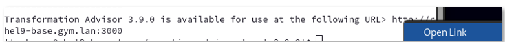

     La página de inicio **de Transformation Advisor** se muestra en el navegador web.

    <kbd></kbd>

    En la siguiente sección, utilizará la interfaz de usuario de Transformation Advisor para descargar la **utilidad de recopilación de datos** para el entorno en el que se ejecutaría WebSphere Application Server, como Windows o Linux.

### 6.3 Descargar la utilidad Transformation Advisor Data Collector

Ahora que se está ejecutando Transformation Advisor, descargará su utilidad Data Collector que se ejecutará en un servidor de aplicaciones WebSphere.

Para evaluar aplicaciones Java locales, debe ejecutar **la utilidad Recopilador de datos de Transformation Advisor** en el entorno del servidor de aplicaciones. Esta herramienta extraerá la información de la aplicación del entorno. La utilidad se puede descargar desde la interfaz de usuario de Transformation Advisor.

1. Desde la página de inicio de Transformation Advisor, cree un **nuevo espacio de trabajo**

    a. Haga clic en el botón **`Create New`** .

    <kbd>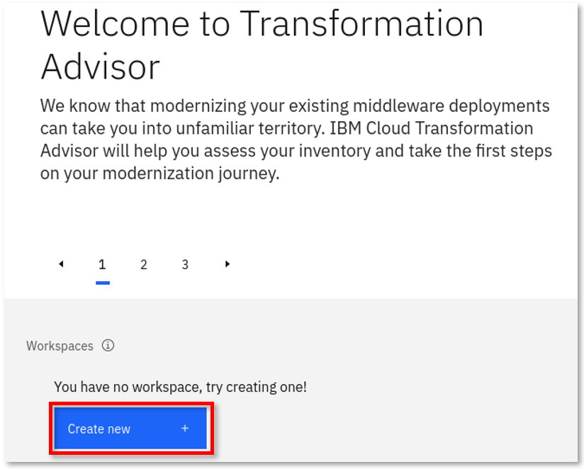</kbd>

    b. Ingrese el nombre del espacio de trabajo como **`Evaluation`** y luego haga clic en el botón **`Create`** .

    <kbd></kbd>

    |                                                                                      |                                                                                                                                                                                                                                                                                           |
    |--------------------------------------------------------------------------------------|-------------------------------------------------------------------------------------------------------------------------------------------------------------------------------------------------------------------------------------------------------------------------------------------|
    | <kbd></kbd> | Un espacio de trabajo es un área designada que albergará las recomendaciones de migración proporcionadas por **Transformation Advisor** desde su entorno de servidor de aplicaciones. Puede nombrarlas y organizarlas como desee, ya sea por aplicación empresarial, ubicación o equipos. |

    Una vez creado el espacio de trabajo, tendrá opciones para **descargar** la utilidad Recopilador de datos o **cargar** un archivo de datos existente.

    <kbd></kbd>

    En este laboratorio, realizaremos los siguientes pasos:

    - Descargue la utilidad Data Collector para el entorno Linux.

    - **Simular** el funcionamiento del recopilador de datos.

    - Cargue un archivo zip de recopilación de datos existente en Transformation Advisor para su análisis.

    - Utilice los aceleradores generados por Transformation Advisor para implementar la aplicación Mod Resorts en Liberty y en contenedores.

2. Haga clic en el botón **`Download`** para descargar el recopilador de datos para Linux

    <kbd></kbd>

3. En la página de descargas, puede descargar la utilidad de recopilación de datos según el sistema operativo de origen para su entorno WebSphere. También muestra cómo usar la utilidad de línea de comandos para recopilar datos de aplicaciones y configuración de servidores WebSphere, WebLogic y Tomcat.

    a. Dado que la máquina virtual del laboratorio es un sistema operativo Linux, haga clic en **`Download Linux`** para obtener la utilidad.

    <kbd></kbd>

    <!-- LBH: Adjusted text as browser requests to clikd save -->

    Mantenga los valores predeterminados y haga clic en Guardar. El archivo comprimido de la utilidad Data Collector se guardará en el directorio **/home/techzone/Downloads** de la máquina virtual **de la estación de trabajo** .

    <kbd></kbd>

    Continúe con la siguiente sección del laboratorio para simular la ejecución de la utilidad del recopilador de datos.

### 6.4 Simular la ejecución de la utilidad Recopilador de datos de Transformation Advisor

Después de descargar la utilidad Data Collector comprimida, es necesario descomprimirla y ejecutarla en un servidor de aplicaciones WebSphere (WAS) para recopilar todos los datos de las aplicaciones implementadas y su configuración desde el servidor WAS.

Ahora, `simulate` los pasos para ejecutar el recopilador de datos.

1. Regrese a la ventana `Terminal` y navegue al directorio **/home/techzone/Downloads** y vea su contenido con los comandos:

    ```
    cd /home/techzone/Downloads/

    ls -l | grep transformationadvisor
    ```

    Puede ver el archivo de utilidad de recopilación de datos descargado llamado “ **transformationadvisor-Linux_Evaluation.tgz** ”

    <!-- LBH: Adjusted image to new TA -->

    <kbd></kbd>

<!-- LBH: Adjusted next section to extract files to Student instead of Downloads: this makes housekeeping easier -->

1. Extraiga la utilidad del recopilador de datos al directorio de estudiantes utilizando el siguiente comando:

    ```
    tar xvfz transformationadvisor-Linux_Evaluation.tgz -C ~/Student
    ```

    La utilidad del recopilador de datos se extraerá al directorio **/home/techzone/Student/transformationadvisor-3.9.0** .

    ---

    **Nota:** En este punto, el recopilador de datos está listo para ejecutarse en un entorno WebSphere.

    ---

2. Regrese a la interfaz de usuario de Transformation Advisor en el navegador web para ver la sección “ **Ejecutar la herramienta** ”, que muestra el comando para ejecutar en el entorno de WebSphere.

    a. Desde la página **Recopilador de datos** , desplácese hacia abajo hasta la sección " **`Run Tool`** ".

    El comando del recopilador de datos que se ejecutará se basa en las selecciones **de dominio** y **tipo de análisis** que realice en esta sección.

    <kbd></kbd>

3. Seleccione el dominio **`IBM WebSphere`** . Otros dominios incluyen otros entornos de ejecución de JAVA EE.

    **Nota:** El comando de la herramienta recopiladora de datos cambia según esta selección.

    <kbd></kbd>

4. Seleccione el tipo de análisis de “ **`Apps and Configuration`** ”

    Al seleccionar **Aplicaciones y configuración** se garantiza que se recopilen los datos de la aplicación y los datos de configuración del servidor.

    Los datos de configuración del servidor son extremadamente útiles en Transformation Advisor para generar artefactos de implementación en el paquete de migración, que exploraremos más adelante en el laboratorio.

    <kbd></kbd>

5. Revise, pero **NO EJECUTE** el comando recopilador de datos que se muestra a continuación, que se basa en las opciones seleccionadas.

    <kbd></kbd>

    ---

    **¡IMPORTANTE!**

    Para este laboratorio, ya ejecutamos el recopilador en un servidor de aplicaciones WebSphere. El archivo comprimido de recopilación de datos resultante, llamado AppSrv01.zip, se proporciona para que lo cargue en la interfaz de usuario de Transformation Advisor.

    ---

### **6.4.1 SOLO PARA FINES ILUSTRATIVOS: Simulación de la ejecución de la utilidad Recopilador de datos de Transformation Advisor**

<table>
<tbody>
<tr class="odd">
<td><kbd></kbd></td>
<td>
<p><strong>Importante:</strong></p>
<p>Esta sección es sólo para fines ilustrativos.</p>
<p>¡NO EJECUTE LOS COMANDOS que se muestran en esta sección!</p>
</td>
</tr>
</tbody>
</table>

Si WebSphere Application Server y Transformation Advisor tienen conectividad, el recopilador de datos podría ejecutarse de la siguiente manera.

1. Ejemplo del comando de utilidad **Recopilador de datos** para iniciar la recopilación de la información de las aplicaciones implementadas en el servidor de aplicaciones WebSphere.

    **Nuevamente, NO EJECUTE el siguiente comando**

    ```
    ./bin/transformationadvisor -w <WEBSPHERE_HOME_DIR> -p <PROFILE_NAME>
    ```

2. Escriba **1** para aceptar el acuerdo de licencia y presione **Enter** , como se ilustra a continuación.

    **Nuevamente, solo como referencia, NO EJECUTE los comandos**

    

    Este es un ejemplo de la salida del recopilador de datos, que muestra el progreso del análisis de los perfiles de WebSphere.

    **¡Nuevamente, sólo para referencia!**

    <kbd>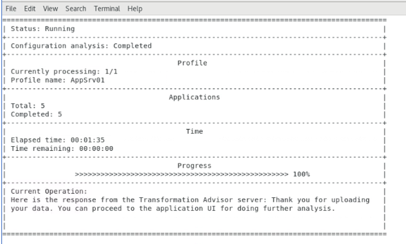</kbd>

    ---

    **NOTA: ¡Los siguientes detalles son sólo para referencia!**

    **NOTA: NO ejecutará el recopilador de datos en este laboratorio.**

    ---

    Este proceso tarda tiempo en completarse, dependiendo de cuántas aplicaciones estén implementadas en el servidor de aplicaciones WebSphere.

    Cuando se complete la utilidad de recopilación, se mostrará el siguiente mensaje:

    **Gracias por subir sus datos. Puede acceder a la interfaz de usuario de la aplicación para realizar un análisis más detallado.**

    Los datos de su solicitud se recopilan y se guardan como un archivo zip.

    En general, si su servidor de aplicaciones y **Transformation Advisor** están en la misma infraestructura de red, los datos recopilados se cargarán automáticamente en **Transformation Advisor** para que pueda ver los resultados del análisis.

    De lo contrario, deberá cargar manualmente los datos en **Transformation Advisor** antes de poder ver los resultados.

### 6.5 Cargar la recopilación de datos en Transformation Advisor

En esta sección, cargará el archivo zip de recopilación de datos “ **AppSrv01.zip** ” desde el entorno de WebSphere para su análisis.

Normalmente, antes de poder cargar los archivos zip del recopilador de datos, deberá descargar el recopilador de datos apropiado para el entorno operativo de su entorno de destino, como Linux, Windows, etc.

Además, ejecutaría el recopilador de datos en el entorno de destino para recopilar los datos de sus aplicaciones. Después, podrá importar los datos recopilados a Transformation Advisor para su análisis.

---

**Consejo:** como se señaló en la sección anterior, los pasos de recopilación de datos ya se han realizado y el archivo **`AppSrv01-3.8.1.zip`** resultante se proporciona en el entorno de laboratorio.

---

1. Regrese a la página Asesor de Transformación en el navegador web, haga clic en el enlace **`Workload type`** para ir a la página Recomendaciones.

    <kbd></kbd>

2. Desde el espacio de trabajo **de Evaluación** , cargue el archivo de recopilación de datos **`AppSrv01-3.8.1.zip`** .

    a. Haga clic en el botón **`Upload`** para cargar un archivo de recopilación de datos.

    <kbd></kbd>

    b. Desde la página Cargar datos, haga clic en el enlace **`Drop or add file`**

    <kbd></kbd>

    <!-- LBH: Adjusted test and picture to Student path -->

    c. Vaya a la ubicación del archivo de recopilación de datos **: Inicio &gt; TechZone &gt; Estudiante &gt; Appmod-pot-labfiles &gt; Labs &gt; TransformationAdvisor** y seleccione el archivo **`AppSrv01-3.8.1.zip`** . Luego, haga clic en el botón **`Open`** en la página.

    <kbd></kbd>

    d. El archivo de recopilación de datos **AppSrv01-3.8.1.zip** ya está listo para cargarse. Haga clic en el botón **`Upload`** para continuar.

    <kbd></kbd>

    Una vez que la recopilación de datos se haya cargado en Transformation Advisor, se le redirigirá nuevamente a la pantalla Recomendaciones de TA.

    Tenga en cuenta que la página muestra “ **Todas las aplicaciones Java** ” del perfil de WebSphere Application Server llamado **AppSrv01-3.8.1** .

    <kbd></kbd>

    Los siguientes detalles se incluyen en la sección `workspace summary` en la parte superior de la página:

    - **Total de aplicaciones** : el número total de aplicaciones en el espacio de trabajo.

    - **Costo promedio por aplicación** : la cantidad promedio de días de esfuerzo de desarrollo necesarios para migrar una aplicación.

    - **Costos totales estimados del espacio de trabajo**

        - **Código común** : el costo total para migrar todo el código común en el espacio de trabajo a la plataforma de destino.

        - **Código de aplicación único** : el costo total para migrar todo el código de aplicación único (código que no se comparte entre aplicaciones) en el espacio de trabajo a la plataforma de destino.

        - **Costo total** : el costo total para migrar todas las aplicaciones y el código común en el espacio de trabajo a la plataforma de destino.

    En la siguiente sección, utilizará Transformation Advisor para ver el análisis de datos de la aplicación que se recopilaron.

### 6.6 Evaluación de aplicaciones Java locales

En esta sección, utilizará la interfaz de usuario de Transformation Advisor para ver los resultados del análisis de datos de la aplicación que se recopilaron en la sección anterior.

1. Desde la página “ **Todas las aplicaciones Java”** , puede ver que se analizaron un total de 5 aplicaciones del servidor WAS.

    <kbd></kbd>

    Al cargar datos, Transformation Advisor detecta automáticamente el **equipo host** del que provienen, es decir, dónde se ejecutaban las aplicaciones del servidor de aplicaciones WebSphere. Transformation Advisor crea la **colección** correspondiente y añade las aplicaciones allí.

    El nombre de la colección se puede anular al ejecutar el recopilador de datos o editar en la interfaz de usuario del asesor de transformación después de cargar los datos.

    En este ejemplo, se utiliza el nombre de colección predeterminado: **admin.ibm.demo** , que es la máquina host de donde provienen los datos.

2. Haga clic en el icono desplegable **`Collections`** y vea el nombre de la colección: “ **admin.ibm.demo** ”

    <kbd></kbd>

    El asesor de transformación analiza todo el **código de la aplicación** y **el código común** que se comparte entre las aplicaciones y proporciona un costo total estimado para migrar las aplicaciones y el código común en el espacio de trabajo.

    El costo total es el número de días de **desarrollo necesarios** para migrar ese código y ejecutarlo en el **destino de migración** seleccionado. En este ejemplo, se ha seleccionado **WebSphere Liberty** como destino de migración.

    **Los objetivos de migración incluyen:**

    - Libertad abierta
    - WebSphere Liberty
    - WebSphere tradicional

    <kbd></kbd>

    Puede elegir varios objetivos de migración y Transformation Advisor le proporcionará el esfuerzo y el costo total del espacio de trabajo para cada uno de los objetivos seleccionados.

    Esto proporciona una vista de alto nivel del alcance del trabajo para migrar todas las aplicaciones de la colección a objetivos de migración específicos.

    |                                                                                      |                                                                                                                                                                                                                                                         |
    |--------------------------------------------------------------------------------------|---------------------------------------------------------------------------------------------------------------------------------------------------------------------------------------------------------------------------------------------------------|
    | <kbd></kbd> | Dependiendo de las aplicaciones, es posible que la migración a Open Liberty requiera más esfuerzo que a WebSphere Liberty. Esto se debe a que Open Liberty no incluye todas las especificaciones de la API de Java EE que sí incluye WebSphere Liberty. |

3. En la sección **Objetivos de migración,** seleccione los **tres** objetivos de migración y observe los diferentes costos de desarrollo asociados con la migración de las cinco aplicaciones en el espacio de trabajo a los diversos entornos de objetivos de migración.

    Aquí puede ver que mover las aplicaciones de la colección a **WebSphere tradicional** requiere **0 días** de costos de desarrollo, lo que significa que no es necesario realizar cambios en el código.

    Sin embargo, migrar a **“WebSphere Liberty”** puede requerir **2,5 días** y “ **Open Liberty”** puede llevar **5,5 días** de tiempo de desarrollo.

    <kbd></kbd>

    La página “ **Todas las aplicaciones Java”** también muestra los resultados del análisis **del resumen** **de aplicaciones** para todas las aplicaciones del perfil AppSrv01 para cada uno de los destinos de migración seleccionados.

    Para cada combinación de aplicación/objetivo de migración, puedes ver estos resultados:

    - Aplicación Java
    - Colección / Nombre del perfil
    - Complejidad
    - Asuntos
    - Cambios de código necesarios
    - Costo de la solicitud (en días)
    - Plan de migración

    <kbd></kbd>

    Los siguientes detalles se incluyen en la tabla de resumen (esta es la vista por aplicación):

    - **Nombre de la aplicación** : el nombre del archivo EAR/WAR que se encuentra en el servidor de aplicaciones.

    - **Colección/Perfil** : La colección representa el nombre de host del equipo donde reside la aplicación. El perfil representa el nombre del perfil en el servidor de aplicaciones donde está instalada la aplicación.

    - **Complejidad** : indica qué tan compleja considera Transformation Advisor que sería esta aplicación si la migrara a la nube.

    - **Problemas** : la cantidad y la gravedad de los problemas potenciales con la migración de la aplicación.

    - **Cambios de código requeridos** : indica el tipo de cambio de código necesario.

    - **Costo de la aplicación en días** : Proporciona una estimación en días del esfuerzo de desarrollo para realizar la migración solo para esta aplicación. Las estimaciones de costos calculadas por Transformation Advisor son solo estimaciones generales y pueden variar considerablemente según las habilidades y otros factores que la herramienta no considera.

    - **Plan de migración** : archivos aceleradores generados por Transformation Advisor para ayudar a crear e implementar la aplicación seleccionada en el entorno de ejecución de destino.

### 6.6.1 Evaluar la aplicación del servicio de pedidos de clientes

En esta sección del laboratorio, explorará los detalles de evaluación para la aplicación de Servicio de pedidos de clientes.

Aprenderá cómo TA proporciona información sobre una aplicación con respecto a la modernización a diferentes tiempos de ejecución de destino, como WebSphere tradicional, WebSphere Liberty y Open Liberty.

Aprenderá por qué los diferentes entornos de destino generan distintos grados de costos de desarrollo y posibles problemas.

1. Desde la página “ **Todas las aplicaciones Java** ” de TA, filtre **CustomerOrderServicesApp.ear** para los tres objetivos de migración, utilizando el campo de búsqueda buscando “ **Customer** ”.

    Esto filtra la lista de aplicaciones solo a “CustomerOrderServicesApp.ear” en Open Liberty, WebSphere Liberty y WebSphere Traditional.

    <kbd></kbd>

2. Lo primero que hay que tener en cuenta es la cantidad de problemas y el costo de la aplicación asociado a la aplicación para cada uno de los tres entornos de destino.

    A un alto nivel podemos observar lo siguiente:

    - Mover la aplicación de WebSphere tradicional en máquinas virtuales a **WebSphere tradicional en contenedores** tiene un nivel de complejidad **SIMPLE** , no se necesitan cambios de código, requiere cero costos de desarrollo y se informaron 2 problemas de información.

    - Mover la aplicación a **WebSphere Liberty** tiene un nivel de complejidad **SIMPLE** , no es necesario cambiar el código, requiere cero costos de desarrollo y se informaron 3 problemas de información.

    - Migrar la aplicación a **Open Liberty** presenta una complejidad **moderada** . Se requiere un cambio de código, parte del cual puede automatizarse. Requiere 3,5 días de desarrollo para resolver un problema de servidor, dos menores y cuatro de información reportados.

    <kbd></kbd>

### 6.6.1.2 Examinar CustomerOrderServicesApp.ear en WebSphere Liberty

A continuación, examinaremos por qué los costos de desarrollo y la cantidad de problemas son mayores al migrar a Open Liberty en lugar de WebSphere Liberty.

Para hacer eso, necesitamos profundizar en algunos de los detalles e informes.

1. Revise los detalles de CustomerOrderSrvicesApp.ear para **WebSphere Liberty**

    a. Haga clic en `CustomerOrderSrvicesApp.ear` para **`WebSphere Liberty`** para abrir su vista de detalles.

    <kbd></kbd>

    b. Amplíe las **`Complexity Rules`** para mover la aplicación a WebSphere Liberty.

    Desde esta vista, obtendrá información sobre los problemas relacionados que pueden requerir cambios de código o cambios de configuración.

    *En este ejemplo se informan 3 problemas de información:*

    - **Seguridad de Java EE**
    - **Base de datos**
    - **Cambio de comportamiento en las búsquedas de Enterprise JavaBeans en versiones anteriores de Liberty**

    Estos **problemas de información** son bien conocidos y están documentados sobre cómo resolverlos mediante las herramientas de migración.

    <kbd></kbd>

    Para profundizar en estas cuestiones, examinemos el **informe de análisis** generado por Transformation Advisor.

    c. Desplácese hasta la parte inferior de la página de detalles de la aplicación para localizar los informes disponibles.

    d. Haga clic en el **`Analysis report`** , que abrirá el informe en una nueva pestaña del navegador.

    <kbd></kbd>

    e. En el **Informe de Análisis de Migración Detallado** , haga clic en el enlace **`Information`** bajo la columna "ETIQUETA". Esto le llevará directamente a los problemas críticos del informe.

    <kbd></kbd>

    f. Haga clic en el enlace **`Show rule help`** para expandir la sección de ayuda para el problema **de seguridad de Java EE** .

    <kbd></kbd>

    g. Lea la “ **ayuda de reglas** ”. Explica que, al migrar aplicaciones que usan seguridad Java EE a la nube, es importante considerar cómo la aplicación usa el registro de usuarios, los Interceptores de Asociación de Confianza (TAI) y los módulos de inicio de sesión personalizados de JAAS, así como su servidor de seguridad local.

    <kbd></kbd>

    h. Para saber dónde en el código de la aplicación están marcados estos problemas, haga clic en el enlace **`show results`** junto al problema.

    <kbd></kbd>

    Verá los módulos, clases, nombres de métodos y números de línea afectados por el problema.

    <kbd></kbd>

2. Regrese a la pestaña del navegador que muestra la “ **Página de detalles de la aplicación** ” y vea el **`Technology report`** .

    <kbd></kbd>

    El informe de tecnología proporciona detalles sobre qué plataformas de IBM admiten las tecnologías Java EE utilizadas por las aplicaciones.

    <kbd></kbd>

    ---

    **Consejo:** Si se omiten las comprobaciones para ediciones específicas de Liberty, el código de la aplicación deberá reescribirse para ejecutarse en ese entorno de destino específico. Esto añade costos de aplicación y de desarrollo al proyecto.

    **Consejo:** WebSphere Liberty incluye más tecnologías Java EE que Open Liberty. Esta es una razón común por la que migrar a Open Liberty puede resultar más costoso que a WebSphere Liberty.

    ---

### 6.6.1.3 Examinar CustomerOrderServicesApp.ear en Open Liberty

En esta sección, examinamos los detalles de la solicitud para pasar a " **Open Liberty"** .

Entendamos por qué el esfuerzo para mover la aplicación a Open Liberty requiere más esfuerzo que moverla a WebSphere Liberty.

1. Regrese a la pestaña del navegador que muestra la **página de detalles de la aplicación** .

2. Desplácese hasta la parte superior y haga clic en “Todas las aplicaciones Java”. <kbd></kbd>

3. Desplácese hacia abajo hasta las aplicaciones Java y busque CustomerOrderServicesApp.ear. <kbd></kbd>

    **Tenga en cuenta** que el tiempo de desarrollo para migrar la aplicación a Open Liberty es de 3,5 días, mientras que para migrar a WebSphere Liberty es de 0 días. Veamos por qué.

4. Haga clic en `CustomerOrderServicesApp.ear` para **`Open Liberty`** para abrir su vista detallada.

    **Consejo:** Puede escribir "Cliente" en el campo de búsqueda para filtrar solo la aplicación de Servicios de pedidos de clientes.

    <kbd></kbd>

5. Expandir las **reglas de complejidad** para ver los detalles de los problemas.

    Podemos ver que al pasar a Open Liberty se detectan problemas relacionados con JPA, caché de segundo nivel de unidad de persistencia y exploraciones CDI que no estaban marcados para WebSphere Liberty.

    <kbd></kbd>

6. Desplácese hacia abajo hasta la sección **“Problemas de código únicos”** de la vista de detalles.

    Podrá ver un desglose del esfuerzo necesario para resolver cada uno de los problemas que se señalaron.

    ---

    **Tenga en cuenta** que abordar estos problemas tecnológicos requiere mucho tiempo y esfuerzo.

    Estos problemas no están presentes cuando se migra a WebSphere Liberty, ya que las API están incluidas con WebSphere Liberty.

    ---

    <kbd></kbd>

<!-- LBH: Addes bullet about automated fix -->

1. Desplácese hacia abajo para ver los detalles de la **solución automática** . <kbd></kbd>

2. Desplácese hacia abajo hasta los informes disponibles. Abra el **`Analysis report`**

    <kbd></kbd>

3. Vaya a las **`Critical rules`** marcadas para la aplicación que se mueve a Open Liberty.

    <kbd></kbd>

4. Expandir la sección **`OpenJPA and WebSphere JPA configuration properties must be migrated`**

    Aquí encontrará que se descubrió `JPA 2.0` en la aplicación.

    Para **Open Liberty** , debe migrar manualmente de JPA 2.0 a la versión estandarizada o a EclipseLink. JPA 2.0 es una especificación Java EE 6 anterior.

    **Open Liberty** no es compatible con esa especificación antigua. Sin embargo, **WebSphere Liberty** sí es compatible con muchas de las especificaciones de la API de Java EE 6, incluida JPA 2.0.

    <kbd></kbd>

En este examen de la aplicación Servicios de pedidos de clientes para **WebSphere Liberty** y **Open Liberty** , obtuvo información acerca de por qué el alcance del esfuerzo para migrar a Open Liberty puede ser MAYOR en comparación con migrar a WebSphere Liberty.

Básicamente, WebSphere Liberty incluye API y bibliotecas JAVA adicionales que Open Liberty no incluye.

### 6.6.1.4 Examine el archivo de configuración del servidor Liberty (server.xml) generado por TA

Transformation Advisor no solo brinda información valiosa sobre las aplicaciones que considera modernizar a WebSphere Liberty u Open Liberty, sino que también genera aceleradores de implementación para crear e implementar la aplicación en Liberty, contenedores y nubes basadas en Kubernetes.

En esta sección, damos un vistazo rápido al `server.xml` **de configuración del servidor Liberty** que genera TA, basado en el análisis de la configuración de WebSphere cuando el recopilador de datos de Transformation Advisor se ejecutó contra el servidor WebSphere en la máquina virtual.

En pocas palabras, Transformation Advisor crea el archivo server.xml que contiene la configuración del servidor Liberty necesaria para ejecutar la aplicación en Liberty.

1. Regrese a la página **“Todas las aplicaciones Java”** en Transformation Advisor, que muestra la lista de resumen de aplicaciones Java

    <kbd></kbd>

2. Asegúrese de que solo esté seleccionado el destino de migración **`WebSphere Liberty`**

    <kbd></kbd>

3. Haga clic en el enlace **`Migration plan`** ubicado junto a **`CustomerOrderServicesApp.ear`** para **`WebSphere Liberty`** , que mostrará el plan de migración para el destino WebSphere Liberty.

    <kbd>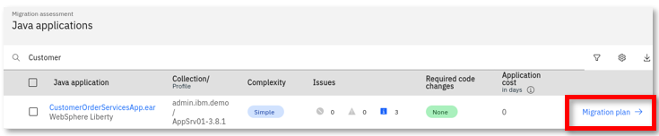</kbd>

4. El **`Migration plan`** muestra una "lista parcial" de archivos generados por el asesor de transformación para ayudar en la migración de la aplicación.

    - **server.xml:** la configuración para el servidor Liberty
    - **pom.xml:** Construye la aplicación usando Maven
    - **Containerfile:** crea la imagen de Docker para la aplicación
    - **Aplicación CR:** Recurso personalizado para la aplicación que se implementará en OpenShift a través del operador Open Liberty
    - **secret.yaml:** Archivo de configuración para la configuración de la conexión a la base de datos en OpenShift

    <!-- LBH: Adjusted picture -->

    <kbd></kbd>

5. Haga clic para ver el contenido del archivo **`server.xml`** .

    <!-- LBH: Adjusted picture -->

    <kbd></kbd>

6. El **server.xml** se muestra en la ventana de vista previa del archivo, haga clic en **`Show more`** para expandirlo.

    <kbd></kbd>

7. Revise el contenido del archivo **server.xml** .

    Tenga en cuenta que Transformation Advisor generó el archivo **server.xml** que incluye la configuración del servidor Liberty que se ha asignado desde el servidor de aplicaciones tradicional WebSphere original.

    Al ejecutar el recopilador de datos de Transformation Advisors en el servidor de aplicaciones WebSphere, este analizó las aplicaciones y la configuración del servidor. Los datos de configuración del servidor se utilizaron para generar un archivo server.xml adecuado para configurar la aplicación en Liberty.

    a. Las **características de Liberty** que utiliza la aplicación están configuradas.

    <!-- LBH: Updated picture -->

    <kbd>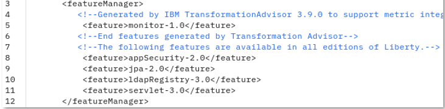</kbd>

    b. Se configuran los **puntos finales de la aplicación** y **la configuración del módulo de la aplicación empresarial,** incluyendo **los roles de seguridad** que utiliza la aplicación. Observe que **las variables ${ }** se utilizan para simplificar las anulaciones de la configuración externa y los valores predeterminados.

    <!-- LBH: Updated picture -->

    <kbd></kbd>

    c. Se han configurado **la configuración de la base de datos** y **los alias de autenticación** . Observe también las variables utilizadas.

    <!-- LBH: Updated picture -->

    <kbd></kbd>

    d. Se configuran **las variables** y los valores predeterminados cuando tiene sentido.

    <!-- LBH: Updated picture -->

    Estas variables se utilizan para extraer datos que probablemente serán diferentes entre entornos, como TEST, QA y PROD.

    Las variables se pueden anular fácilmente mediante variables de entorno o configMaps y secretos en entornos de Kubernetes.

    <kbd></kbd>

<!-- LBH: Added app dependencies -->

1. Cierre la vista previa del archivo, desplácese hacia abajo y abra el archivo Twisty para ver las dependencias de la aplicación. Como puede ver, la aplicación requería los archivos JAR del controlador DB2. <kbd></kbd>

2. Haga clic para descargar el **Plan de Migración** generado por Transformation Advisor

    <kbd></kbd>

    Deje la carpeta de destino y el nombre del archivo y pulse Guardar. El paquete de migración, en formato zip, se descargará en el directorio **de descargas** de la máquina virtual.

3. Cambie a la ventana de terminal y ejecute el siguiente comando para ver el contenido del paquete de migración.

    ```
    unzip -l customerorderservicesapp.ear_migrationBundle.zip
    ```

    <kbd></kbd> Además de los archivos mencionados anteriormente, el paquete de migración contiene varios otros archivos para la implementación de Kubernetes, para la personalización, así como archivos de marcador de posición para la aplicación y los controladores JDBC.

### 6.6.2 Evaluar la aplicación de Mod Resorts

**Mod Resorts es una de las aplicaciones que queremos considerar migrar a Liberty.**

En esta sección, revisará los resultados del análisis de la aplicación **modresorts-1_0_war.ear** y determinará si es un buen candidato para la migración a Open Liberty o WebSphere Liberty.

1. Regrese a la página “Todas las aplicaciones Java” en Transformation Advisor.

    <kbd></kbd>

2. Seleccione los tres objetivos de migración del menú

    <kbd></kbd>

3. En el campo **"Buscar"** , escriba **`modresorts`** , lo que limitará la lista de aplicaciones a solo la aplicación Mod Resorts para los tres objetivos de migración.

    <kbd></kbd>

    En este ejemplo, si desea mover la aplicación **modresorts-1_0_war.ear** a **Open Liberty** , el nivel de complejidad es **Simple** , lo que indica que no es necesario cambiar el código de la aplicación antes de poder moverla a Open Liberty.

    La aplicación no tiene dependencias, código común ni archivos de biblioteca compartidos. Presenta un pequeño problema informativo.

    El esfuerzo de desarrollo estimado es de día cero porque no se requiere ningún cambio de código.

    <kbd></kbd>

    Tenga en cuenta que la aplicación modresorts también es sencilla de migrar a los destinos de migración tradicionales de WebSphere Liberty y WebSphere.

    <kbd></kbd>

    En este laboratorio, se centrará en la modernización de `moderesorts-1.0_war.ear` a `Open Liberty` .

    A continuación, verá los resultados del análisis de la aplicación **moderesorts-1.0_war** .ear en detalle.

4. Haga clic en el enlace **`modresorts-1_0_war.ear`** dirigido a **Open Liberty** para ampliar los resultados de su análisis.

    <kbd></kbd>

    La primera sección de la página de resumen del análisis detallado es la **sección "Reglas de complejidad"** . La complejidad general de la aplicación es **simple** , lo que indica que se puede migrar directamente a Open Liberty sin modificar el código.

    <kbd></kbd>

5. Desplácese hacia abajo hasta la sección **`Complexity Rules`** . Puede ver que no se requiere ningún cambio de código ni ningún costo de desarrollo; el costo estimado de desarrollo total de la migración es de **0 días** .

    Esta estimación se basa en datos de los compromisos de IBM Services, que incluyen la migración del código de la aplicación, pero no abarcan el alcance total de un proyecto de migración que incluiría la configuración del servidor, pruebas, etc.

    <kbd></kbd>

6. Expande la sección **`Issues and details`** . Puedes ver que el único problema potencial menor mencionado es la configuración de CDI (beans de inyección de dependencia de contexto).

    <kbd></kbd>

7. A continuación, desplácese hasta la parte inferior de la página y haga clic en el enlace **`Technology Report`** ; esto abre una nueva ventana del navegador para mostrar el Informe de evaluación de la aplicación.

    <kbd></kbd>

    El **informe de tecnología** enumera todas las tecnologías Java que utiliza la aplicación y si estas tecnologías son compatibles con una plataforma WebSphere específica, desde Liberty para Java en IBM Cloud hasta WebSphere tradicional para z/OS.

    Se utiliza para determinar si un producto WebSphere en particular es adecuado para una aplicación.

    <table>
    <tbody>
    <tr class="odd">
    <td><kbd></kbd></td>
    <td>
    <p><strong>CONSEJO:</strong></p>
    <p>Si la complejidad de migrar al entorno de destino es “ <strong>Compleja</strong> ”, significa que algunas API no están disponibles en el entorno de ejecución de destino y la aplicación deberá reescribirse para usar API diferentes.</p>
    </td>
    </tr>
    </tbody>
    </table>

    <kbd></kbd>

    Como puede ver en el informe, la aplicación Mod Resorts solo utiliza **Java Servlet** , que es compatible con todas las ediciones de WebSphere.

8. Regrese a la página Asesor de Transformación y haga clic en el enlace **`Inventory Report`** .

    <kbd></kbd>

    El **Informe de inventario** le ayuda a examinar lo que hay en su aplicación, incluida la cantidad de módulos, sus relaciones y las tecnologías en esos módulos.

    También ofrece una vista de todos los archivos JAR de utilidades en la aplicación y los **nombres de los paquetes Java** en los archivos JAR, lo que ayudará a identificar si las clases corresponden al código de la aplicación del cliente o a código de <sup>terceros</sup> . También se incluyen posibles problemas de implementación y consideraciones de rendimiento.

    <kbd></kbd>

    a. Desplácese hacia abajo por el `Inventory Report` para ver este informe que sirve como una buena herramienta para la toma de decisiones que le informa qué hay dentro del tiempo de ejecución de su aplicación y le ayuda a comprender mejor el tiempo de ejecución de la aplicación, los componentes que tiene y las relaciones entre ellos.

    <kbd></kbd>

9. En el `Inventory report` , vea los nombres de los paquetes de las clases en la utilidad Jars

    a. Desplácese hacia abajo para ver la sección **Archivos contenidos** y haga clic en el enlace " **Mostrar detalles** " junto a **modresorts-1.0.war.**

    b. Desplácese hacia abajo hasta los **archivos JAR de la utilidad** y haga clic en el enlace " **Mostrar detalles** " junto a los archivos JAR de la utilidad.

    c. Ver los **nombres de archivo** de los archivos jar y los **paquetes** utilizados en los archivos JAR.

    Esta es una buena forma de determinar si el código en los JARS de utilidad incluye código de cliente o si son jars de <sup>terceros</sup> como (org.pache*).

    Además, si la complejidad de la migración de la aplicación es SIMPLE, es posible que desee verificar si los archivos JAR de utilidad incluyen paquetes de la empresa que comiencen con org u otros nombres de paquetes que se IGNORARON de manera predeterminada en el recopilador de datos de Transformation Advisor.

    Podría ser posible que el código de la aplicación no se haya analizado debido a que el recopilador de datos ignora los nombres de los paquetes.

    <kbd></kbd>

    De los informes de análisis que revisó anteriormente, sabe que la aplicación Mod Resorts cuenta con el respaldo de Open Liberty y que el problema que identificó la herramienta no afectaría la migración de la aplicación.

    Puede seleccionar con confianza la aplicación como un buen candidato para migrar a Open Liberty con un mínimo esfuerzo.

### 6.7 Descripción general de la aplicación Mod Resorts

Gracias a los conocimientos adquiridos de Transformation Advisor, usted aprendió que Mod Resorts es una aplicación EE simple y es un buen candidato para migrar a Open Liberty y a nubes basadas en contenedores.

Con fines ilustrativos, en esta breve sección se capturan algunas capturas de pantalla para ilustrar la aplicación Mod Resorts.

La página de inicio de la aplicación Mod Resorts se ilustra aquí:

<kbd></kbd>

El usuario seleccionaría el destino de su viaje.

<kbd></kbd>

Quizás el usuario quiera ir a **París, Francia. Mod Resorts muestra el** clima de la ciudad.

<kbd></kbd>

Continúe con la siguiente sección del laboratorio, donde se le presentará brevemente el plan de migración de Transformation Advisor.

El plan de migración incluye un paquete de migración de artefactos de implementación generados que aceleran la implementación de la aplicación en Liberty y la implementación en la nube basada en contenedores.

## 7. Explora el paquete de migración para la aplicación Mod Resorts

Transformation Advisor muestra detalles sobre el **paquete de migración** generado para acelerar la modernización de aplicaciones a Liberty o WebSphere tradicional en contenedores y a OpenShift. El paquete de migración incluye diversos artefactos, según las necesidades de la aplicación, para acelerar la compilación y la implementación de una imagen de Docker en la plataforma OpenShift.

Ahora, exploremos rápidamente el **plan de migración** de la aplicación Mod Resorts para ver los artefactos que Transformation Advisor crea para acelerar la implementación de la aplicación en OpenShift Platform.

1. Regrese a la página “ **Todas las aplicaciones Java** ” en Transformation Advisor, que muestra la lista de resumen de aplicaciones Java

    <kbd></kbd>

2. Asegúrese de que solo esté seleccionado el objetivo de migración **`Open Liberty`**

    <kbd></kbd>

3. Haga clic en el enlace **`Migration plan`** ubicado junto al análisis de la aplicación Mod Resorts para `Open Liberty` , que mostrará **`migration plan`** para modresorts para el objetivo Open Liberty

    <kbd></kbd>

4. Haga clic en el enlace **`Download`** para descargar el paquete de artefactos al sistema de archivos local en la máquina virtual de la estación de trabajo.

    <kbd></kbd>

    Acepte los valores predeterminados y haga clic en **Guardar.** <kbd></kbd> El archivo **modresorts10war_migrationBundle.zip** se descargará en el directorio **/home/techzone/Downloads**

5. Descomprima los artefactos del paquete de migración en una nueva carpeta en la máquina virtual de la estación de trabajo

    <!-- LBH: Changed path to Student -->

    a. Desde una ventana de terminal, ejecute los siguientes comandos para descomprimir el paquete de migración en un nuevo directorio llamado " **modresorts-bundle** ":

    ```
    mkdir /home/techzone/Student/modresorts-bundle

    cd /home/techzone/Student/modresorts-bundle

    mv ~/Downloads/modresorts10war.ear_migrationBundle.zip .

    unzip modresorts10war.ear_migrationBundle.zip

    ls
    ```

    <kbd></kbd>

6. Vea el archivo **server.xml** . NO CAMBIE EL CONTENIDO DEL ARCHIVO.

    El archivo server.xml en el paquete de migración es el archivo de configuración del servidor Liberty generado por Transformation Advisor, configurado para la aplicación modresorts.

    ```
    gedit ~/Student/modresorts-bundle/src/main/liberty/config/server.xml
    ```

    <kbd></kbd>

    - La lista de características de Liberty incluye características que la aplicación requiere.

    - Se incluye la función **mpMetrics** , que proporciona un punto final /metrics desde el cual puede acceder a todas las métricas emitidas por el servidor Open Liberty y las aplicaciones implementadas.

    - Las variables se utilizan para que los valores que probablemente sean diferentes entre entornos puedan ser fácilmente anulados por configuraciones externas como variables de entorno o configMaps y Secrets en Kubernetes.

7. **Cierre** el editor al terminar de revisar el archivo. **NO GUARDE ningún cambio** en el contenido.

8. Visualice el archivo **Containerfile** . No modifique su contenido.

    El archivo Containerfile del paquete de migración se utiliza para crear la imagen del contenedor y ejecutar la aplicación modresorts en un entorno de ejecución de Liberty en un entorno contenedorizado como Docker, Kubernetes o Red Hat OpenShift. Transformation Advisor generó el Containerfile y lo configuró para la creación de la aplicación modresorts.

    ```
    gedit ~/Student/modresorts-bundle/Containerfile
    ```

    - El Containerfile es un Containerfile de dos etapas.

        - La primera fase es la “ **etapa de compilación** ”, que crea una imagen de Docker para la aplicación modresorts.

            <kbd>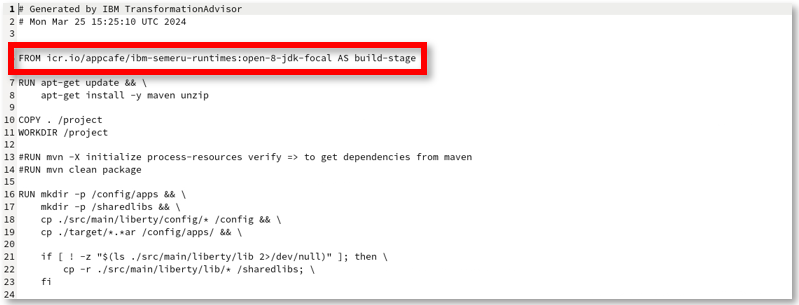</kbd>

        - La segunda etapa utiliza la imagen del contenedor **del kernel Open Liberty** y los artefactos de compilación producidos en la “etapa de compilación” para compilar la imagen del contenedor modresorts con la aplicación modresorts y los archivos de configuración para implementar en un entorno de contenedor.

            <kbd></kbd>

9. **Cierre** el editor al terminar de revisar el archivo. **NO GUARDE** ningún cambio en el contenido.

10. Finalmente, debe agregar el archivo de la aplicación Modresorts al directorio de destino del paquete de migración. Para identificar el directorio de destino, busque el archivo de marcador de posición que Transformation Advisor agregó al paquete de migración. Luego, reemplace el archivo de marcador de posición con el archivo de la aplicación en el directorio correspondiente.

    ```
    find ~/Student/modresorts-bundle -name *.placeholder
    cp ~/Student/appmod-pot-labfiles/labs/TransformationAdvisor/modresorts-1.0.war ~/Student/modresorts-bundle/target
    rm ~/Student/modresorts-bundle/target/*.placeholder
    ls ~/Student/modresorts-bundle/target
    ```

    <kbd>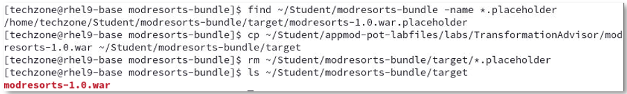</kbd>

## 8. Utilice los aceleradores de implementación de Transformation Advisor para implementar y ejecutar la aplicación Mod Resorts en Open Liberty

En esta sección, instalará Open Liberty, creará un nuevo servidor Liberty y aprovechará los artefactos generados por Transformation Advisor para configurar y ejecutar la aplicación Mod Resorts en su nuevo servidor Open Liberty.

---

**Consejo:** Open Liberty se instala desde un archivo zip.

Para el laboratorio, el archivo zip de Open Liberty ya se ha descargado en el entorno del laboratorio.

---

Para empezar, creará un nuevo directorio donde desea instalar Open Liberty. Luego, descomprima el archivo. Listo, Open Liberty está instalado.

1. Instalar Open Liberty en la máquina virtual

    a. Desde una ventana de Terminal, ejecute los siguientes comandos para descargar el archivo de Open Liberty

    ```
    wget https://public.dhe.ibm.com/ibmdl/export/pub/software/openliberty/runtime/release/23.0.0.12/openliberty-javaee8-23.0.0.12.zip  -P ~/Student
    ```

    b. Ejecute los siguientes comandos para realizar una instalación de archivo de Open Liberty

    ```
    mkdir ~/Student/Liberty
    unzip ~/Student/openliberty-javaee8-23.0.0.12.zip -d ~/Student/Liberty
    ```

    c. Open Liberty se instala en el directorio **/home/techzone/Student/Liberty/wlp** . Vaya al directorio raíz de Open Liberty.

    ```
    cd ~/Student/Liberty/wlp
    ```

2. Utilice el comando **`server`** para crear un nuevo servidor Open Liberty llamado **`modresorts_server`**

    ```
    bin/server create modresorts_server
    ```

    <kbd></kbd>

3. Utilice el comando **`server`** para iniciar el servidor Open Liberty llamado **`modresorts_server`** . La configuración del servidor se almacenará en **`usr/servers`** .

    ```
    bin/server start modresorts_server
    ```

    <kbd>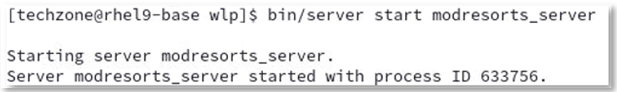</kbd>

4. Abra una nueva ventana `Terminal` y vea el archivo de registro del servidor Open Liberty llamado “messages.log”

    ```
     cd ~/Student/Liberty/wlp
     tail -f usr/servers/modresorts_server/logs/messages.log
    ```

    a. Busque el mensaje que indica que el servidor de Modresorts se inició correctamente.

    <kbd>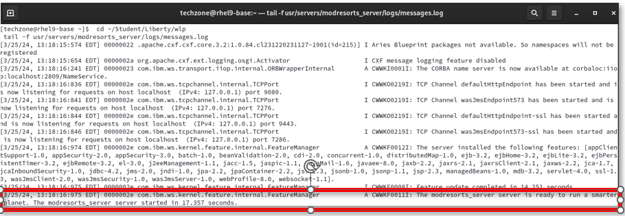</kbd>

    En este punto, tiene un servidor Open Liberty ejecutándose con la configuración predeterminada. Sin embargo, no hay aplicaciones instaladas (implementadas).

    A continuación, copiará el binario de Mod Resorts (WAR) al servidor Open Liberty, donde la aplicación se implementará e iniciará. Después, copie el archivo de configuración del servidor Open Liberty que TA generó para la aplicación Mod Resorts.

    El servidor Liberty detectará y aplicará automáticamente estos cambios en el servidor en ejecución.

5. Vaya a la ventana `Terminal` donde inició Liberty. Instale la aplicación modresorts en el servidor Open Liberty usando el archivo WAR incluido en el paquete de migración de Transformation Advisor.

    ```
    cp ~/Student/modresorts-bundle/target/modresorts-1.0.war usr/servers/modresorts_server/apps
    ```

    El comando anterior copió el archivo WAR de la aplicación modresorts a la carpeta “ **apps** ” de Open Liberty, donde está configurado el archivo **server.xml** para ejecutar la aplicación.

6. Copie el archivo **server.xml** que generó Transformation Advisor, que incluye la configuración del servidor Open Liberty para la aplicación modresorts

    a. Desde una ventana `Terminal` , ejecute el siguiente comando para copiar el archivo **server.xml** al directorio de configuración **modresorts_server** .

    ```
    cp ~/Student/modresorts-bundle/src/main/liberty/config/server.xml usr/servers/modresorts_server
    ```

    b. En la ventana de Terminal, al ejecutar el comando " **tail** " en el archivo de registro de Open Liberty, observe que el servidor se está actualizando para reflejar las actualizaciones en el nuevo archivo server.xml que copiamos en la configuración de ejecución de Liberty.

    **Nota:** Verá un mensaje que indica que se inició la aplicación modresorts.

    <kbd>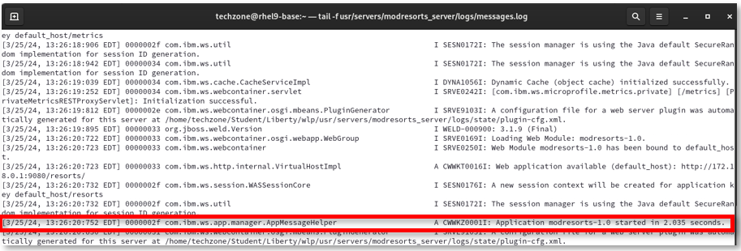</kbd>

7. Ejecute la aplicación modresorts desde el navegador web en la máquina virtual. El contexto raíz de la aplicación es `/resorts` y está definido en el archivo server.xml de Open Liberty.

    ```
    http://localhost:9080/resorts
    ```

    <kbd></kbd>

    a. Puede hacer clic en el menú desplegable "¿ **A DÓNDE** ?" y seleccionar un destino.

    <table>
    <tbody>
    <tr class="odd">
    <td><kbd></kbd></td>
    <td>
    <p><strong>¡Consejo!</strong></p>
    <p>Si la aplicación no responde al hacer clic en el menú “¿A DÓNDE?”, aumente el tamaño de la ventana del navegador web.</p>
    </td>
    </tr>
    </tbody>
    </table>

    <kbd></kbd>

8. En la ventana de Terminal que ejecuta el comando “ **tail** ” en el archivo de registro de Open Liberty, observe que se ha accedido a la aplicación.

    <kbd></kbd>

9. Acceda a la ventana `Terminal` donde inició Liberty. `Stop` el servidor Open Liberty desde una ventana de Terminal.

    ```
    bin/server stop modresorts_server
    ```

    <kbd></kbd>

10. Regrese a la ventana de Terminal ejecutando el comando “ **tail** ”, luego use **CTL-C** para detener el comando “ **tail** ”.

## 9. Utilice los aceleradores de Transformation Advisor para ejecutar la aplicación Mod Resorts en Open Liberty en contenedores

En esta sección, utilizará el `Containerfile` del paquete Transformation Advisor para crear una imagen de contenedor y ejecutar la aplicación modresorts en un contenedor local.

El `Containerfile` es un Containerfile de dos etapas:

- La primera fase es la “ **etapa de compilación** ”, que crea una imagen de Docker para la aplicación modresorts.

- La segunda etapa utiliza la imagen del contenedor **del kernel Open Liberty** y los artefactos de compilación producidos en la “etapa de compilación” para compilar la imagen del contenedor modresorts con la aplicación modresorts y los archivos de configuración para implementar en un entorno de contenedor.

    - **RUN features.sh** descarga las características de Open Liberty que están definidas en el archivo server.xml
    - **EJECUTAR configure.sh** instala las características de Open Liberty en la imagen de Docker.

1. Cree la imagen de Docker que incluye la aplicación modresorts en Open Liberty

    a. Desde una ventana de Terminal, cambie al directorio donde se encuentra el paquete de migración de Transformation Advisor.

    ```
    cd ~/Student/modresorts-bundle
    ```

    b. Ejecute el comando de compilación de Docker para compilar la imagen.

    - El nombre de la imagen de Docker será **modresorts:1.0,** como se especifica en el parámetro -t (etiqueta).

    - La imagen del contenedor se crea a partir de las directivas en el **Containerfile** según lo especificado por el parámetro -f (etiqueta).

    - La imagen del contenedor se crea utilizando los artefactos en el directorio actual del paquete de migración, como se especifica en el **punto** de entrenamiento en el comando

        ```
          docker build --no-cache -t modresorts:1.0 -f Containerfile .
        ```

    Cuando termine, verá que la imagen del contenedor se creó y se etiquetó como “ **modresorts:1.0** ”.

    <kbd></kbd>

    c. Enumere la imagen del contenedor y su etiqueta. El nombre de la imagen es " **modresorts** " y está etiquetada como " **1.0** ".

    ```
    docker images | grep modresorts
    ```

    <kbd></kbd>

2. Ejecute la aplicación Modresorts en el contenedor

    ```
    docker run -d -p 9081:9080 --name modresorts modresorts:1.0
    ```

    - **-d** ejecuta el comando docker en modo separado

    - **-p** asigna el potenciómetro interno 9080 a un puerto externo 9081

    - **--name** especifica el nombre del contenedor docker que se pone en marcha

    - **Modresorts:1.0** es el nombre de la **imagen de Docker** que se usará para poner en marcha el nuevo contenedor

3. Verifique que el contenedor Docker se esté ejecutando

    ```
    docker ps | grep modresorts
    ```

    El comando “ **docker ps** ” enumera los contenedores que están “en ejecución”.

    Al ejecutar “ **docker ps -a** ” se enumeran todos los contenedores, incluidos los que están detenidos.

    <kbd></kbd>

4. Vea el registro de Open Liberty en el contenedor “ **modresorts** ” para verificar que la aplicación modresorts se instaló y se está ejecutando

    ```
    docker logs modresorts
    ```

    <kbd></kbd>

5. Ejecute la aplicación modresorts desde el navegador web.

    - La aplicación está expuesta en el puerto: **9081**

    - La raíz del contexto de la aplicación es: **/resorts**

        http://localhost:9081/resorts

    <kbd></kbd>

    a. Puede hacer clic en el menú desplegable "¿ **A DÓNDE** ?" y seleccionar un destino.

    <table>
    <tbody>
    <tr class="odd">
    <td><kbd></kbd></td>
    <td>
    <p><strong>¡Consejo!</strong></p>
    <p>Si la aplicación no responde al hacer clic en el menú “¿A DÓNDE?”, aumente el tamaño de la ventana del navegador.</p>
    <p>Esto parece ser un problema con la aplicación.</p>
    </td>
    </tr>
    </tbody>
    </table>

    <kbd></kbd>

## 10. Limpieza

1. **`Stop`** y **`remove`** el contenedor. Luego, verifique que se haya eliminado con el comando " **docker ps -a".**

    ```
    docker stop modresorts

    docker rm modresorts

    docker ps -a | grep modresorts
    ```

2. **`Remove`** la imagen del contenedor de modresorts. Luego, use el comando " **docker images** " para verificar que la imagen se haya eliminado.

    ```
    docker rmi modresorts:1.0

    docker images | grep modresorts
    ```

3. Por último **`remove`** la carpeta **`Student's`** y los recursos descargados.

    ```
    cd ~
    rm -rf ~/Student
    rm ~/Downloads/*
    ```

4. Asesor de Detención de Transformación

    ```
     cd /home/techzone/transformation-advisor-local-3.9.0
     scripts/stopTransformationAdvisor.sh
    ```

5. Cierre el navegador y todas las ventanas de terminal.

## Resumen

En este laboratorio, aprendió a evaluar la aplicación Java existente utilizando IBM Cloud Transformation Advisor.

Aprendió a usar los aceleradores de implementación generados por Transformation Advisors desde el paquete de migración para crear y ejecutar una aplicación en Open Liberty en modo independiente en una máquina virtual y en contenedores.

Como parte de las soluciones de modernización de aplicaciones de IBM, la herramienta Transformation Advisor proporciona una recomendación para la edición adecuada de IBM WebSphere Application Server y ofrece consejos, mejores prácticas y posibles soluciones para evaluar la facilidad de trasladar aplicaciones a Liberty o al contenedor WAS, o a versiones más nuevas de WebSphere tradicional.

Transformation Advisor acelera la migración de aplicaciones a Liberty y contenedores y ayuda a minimizar errores y riesgos y reducir el tiempo de comercialización.

<br>

**¡Felicidades!**

**Ha completado con éxito el laboratorio “Exploración de la recopilación de datos, las evaluaciones de aplicaciones y los aceleradores de implementación de IBM Transformation Advisor”.**
